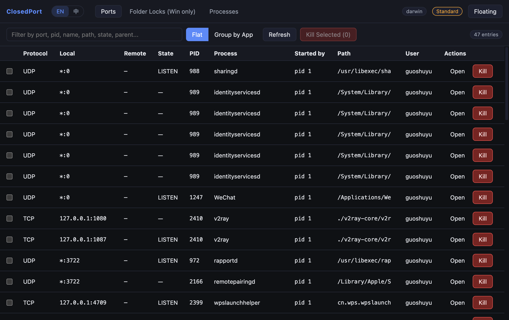
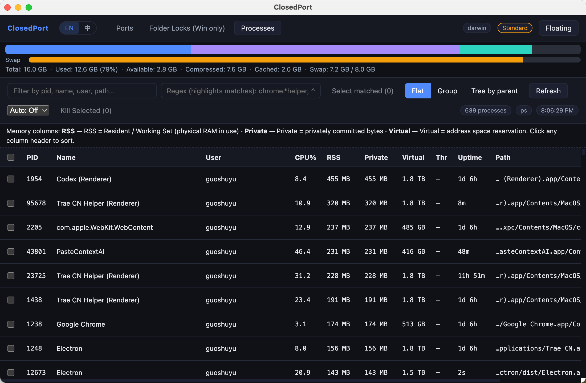
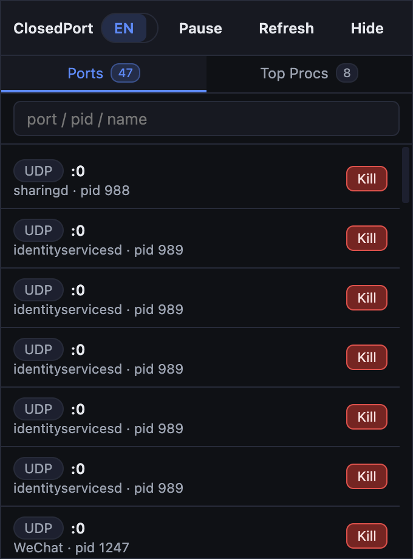

# Features

ClosedPort 的完整功能说明。简要介绍请回到 [项目主 README](../README.md)。

## Ports — 端口占用

- **协议**：TCP / UDP / TCP6 / UDP6 监听与连接，附 PID、进程名、可执行文件路径、用户、命令行
- **Started by（父进程）**：每条记录显示父进程名 + PPID，定位"这个端口到底是哪个家伙拉起来的子进程占住的"
- **Group by App**：一个进程占多个端口时聚合显示，整组一键 Kill；支持 Name / Ports / PIDs 升降序
- **正则高亮 + 多选 Kill**：正则匹配的行高亮，可继续手动 checkbox 增减选择
- **快速过滤**：任何关键字（PID / 名 / 用户 / 命令行）即时筛选

**Group by App 视图**：

## Processes — 进程总览（含内存批量释放）

跨平台列举所有运行中的进程。三种视图**共享同一选中集合**，切换视图勾选不丢，可一次性把跨视图勾出来的进程全部 Kill。

### 三种视图

| 视图 | 用途 | 关键特性 |
| --- | --- | --- |
| **Flat** | 平铺浏览，按指标排序 | 行级 checkbox、表头全选、点 PID / Name / CPU% / RSS / Private / Virtual / Threads / Uptime 排序 |
| **Group by name** | 找内存大户（如 `chrome.exe` × 30） | 组按总 RSS 降序、组级三态 checkbox、`Kill Group (N)` 一键端整族 |
| **Tree by parent** | 看清父子拉起链 | 按 `parentPid` 递归、子节点缩进、Expand all / Collapse all、子树匹配保留父链 |

### 批量内存释放工作流

1. 切到 **Group by name** 视图，列表按总 RSS 自动降序
2. 顶部内存大户一目了然（chrome.exe × 30、node.exe × 12…）
3. 想清理某一族 → 直接点该组的 `Kill Group (N)`
4. 想跨进程精挑细选 → 任意视图勾 checkbox，顶部 `Kill Selected (N)` 一次性释放
5. 释放后 5s / 10s / 30s auto-refresh 自动重算

### 工具栏

- **Filter** 任意关键字过滤；**Regex** 高亮 + `Select matched` 把匹配 PID **加入**（非杀）当前选中
- **Auto-refresh**：Off / 5s / 10s / 30s（链式 setTimeout，慢机器不会堆队列）
- **Loading 态**：首次加载显示 spinner + 骨架占位行；刷新中顶部 2px 进度条，不会"点过来一片空白"
- **Kill Selected**：仅在有勾选时变红（避免空状态的视觉警告），否则保持中性按钮态

### 列语义

| 列 | 含义 | 备注 |
| --- | --- | --- |
| PID | 进程号 | |
| Name | 进程名 | hover 显示完整 commandLine |
| User | 进程所有者 | macOS / Linux 取自 `ps`，Windows 取自 CIM |
| CPU% | 平均 CPU 占用 | 自进程启动累计平均；>100% 表示多核占用 |
| **RSS** | Resident / Working Set | 物理 RAM 实际持有量 |
| **Private** | 私有提交字节 | 不与其他进程共享的已提交内存 |
| **Virtual** | 虚拟地址空间 | 整个地址空间预留（大不代表占用大） |
| Thr | 线程数 | |
| Uptime | 已运行时长 | |
| Path | 可执行文件路径 | hover 看完整路径 |

> Windows 内存语义和 macOS / Linux 不完全等价。Working Set 在 Windows 下可被共享页贡献；如果你做精细对比，参考各 OS 的 [Memory Counters](https://learn.microsoft.com/en-us/windows/win32/perfctrs/memory-counters)。

### 平台后端实现

| 平台 | 实现 |
| --- | --- |
| **Windows** | `Get-CimInstance Win32_Process` + PowerShell 哈希表 join `Get-Process`，**单次 round-trip** 同时拿到 `Pid` / `Name` / `WorkingSet` / `PrivateMemorySize` / `VirtualMemorySize` / `CPU` / `Threads` / `Path` / `Started` / `ParentProcessId` / `CommandLine` |
| **macOS / Linux** | `ps -ax -o pid,ppid,user,%cpu,rss,vsz,thcount,etime,comm,args` 一次拿全 |

更多设计取舍 → [architecture.md](./architecture.md)。

## Folder Locks — 文件夹占用（Windows）

- 谁锁着我 `node_modules` / 工作目录里的文件？拖文件夹进面板即可扫描
- 优先 Sysinternals [`handle.exe`](https://learn.microsoft.com/en-us/sysinternals/downloads/handle)，缺失时自动回退 Restart Manager API
- 每行可看 PID + 进程名 + 句柄类型，按 PID 多选 Kill
- 默认下钻一层子目录（详见 architecture.md 关于"为什么默认下钻一层"）

## 通用 General

- **一键 Kill** — 单条 / 多选 / 整组三粒度。Windows `taskkill /F /T`，macOS / Linux `SIGKILL`
- **Tab 状态保留** — Ports / Processes / Folder Locks 切换不会清空过滤、排序、展开的分组、扫描结果、勾选
- **悬浮迷你面板** — 常驻置顶 + 所有桌面可见 + 跳过任务栏，可暂停自动刷新

  

- **托盘集成** — 单实例锁、托盘菜单切换主窗口 / 悬浮窗 / 退出
- **System Idle / Kernel 智能命名** — Windows PID 0 / PID 4 单独归类，不会再混在 "Unknown"
- **零原生依赖** — 纯 Node + 平台原生命令行，无 native 模块编译

## 相关文档

- [architecture.md](./architecture.md) — 后端实现表 + 项目结构 + 关键设计决策
- [development.md](./development.md) — 本地开发 / Spawn test ports 诊断
- [packaging.md](./packaging.md) — electron-builder 打包 / 签名状态 / Release CI
- [testing.md](./testing.md) — E2E / Smoke / 截图回归
- [faq.md](./faq.md) — 常见问题
